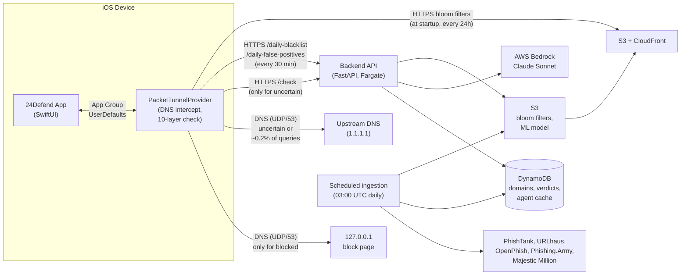
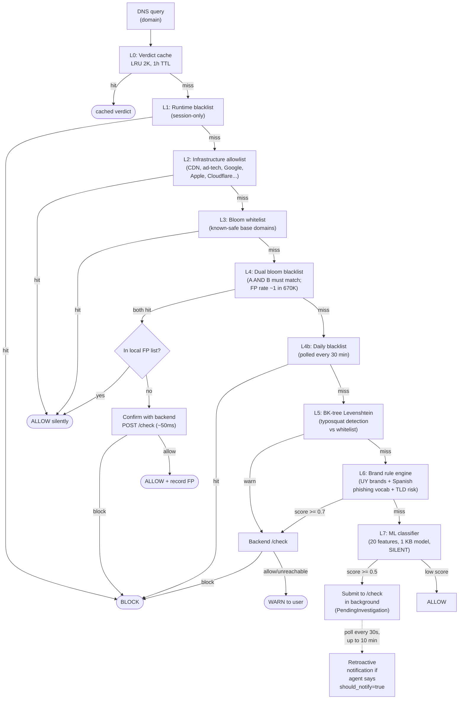
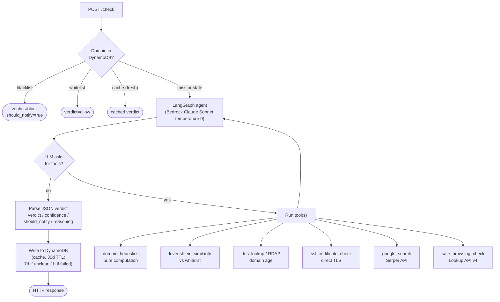

# Architecture diagram

Quick-glance system view. Read this first, then dive into
[../architecture.md](../architecture.md) for full detail (~900 lines).

The system has four parts:

1. **iOS app** — SwiftUI app + NetworkExtension packet tunnel doing DNS
   interception. On-device pipeline of 10 layers. The vast majority of DNS
   queries (~98%) never touch the network.
2. **Backend API** — FastAPI on AWS Fargate. Handles `/check` (per-domain
   verdict), `/daily-blacklist`, bloom-filter serving, and admin endpoints.
3. **LangGraph investigation agent** — backend-internal. Runs only for
   uncertain domains. Bedrock Claude Sonnet driving a tool-using loop.
4. **Ingestion + ML pipelines** — backend-internal scheduled jobs that build
   bloom filters from public threat feeds and ship an on-device ML model.

---

## High-level



**Key property**: the device only contacts the backend for domains that
weren't conclusively handled by the on-device layers. Cache hit rate is
~98.2% — most DNS queries never leave the device.

---

## On-device detection pipeline (10 layers)

Each DNS query runs through these in order. First match wins. See
[../architecture.md](../architecture.md) section "10+ Layer Check Order" for
the full per-layer behavior.



**Important**: Layer 7 (ML) never produces a user-facing warning. Only
Layers 5 and 6 do. Layer 4 always confirms with the backend before
blocking; bloom filter alone is never enough.

---

## Backend agent flow (LangGraph)

Only runs when `/check` is called on a domain not in DynamoDB. Loops
LLM → tools → LLM until the LLM returns a final JSON verdict.



`should_notify` is **agent-owned**: the iOS app trusts the boolean in the
response. The agent only sets it true under strict criteria (confidence ≥
0.85, identifiable brand impersonation, multiple converging signals).
Blacklist hits always set `should_notify=true`. See
[../CLAUDE.md](../CLAUDE.md) "Pending investigations (retroactive
warnings)".

---

## Data flow: ingestion → device

How the daily blacklist and bloom filters get from public threat feeds to a
user's phone.

```
+-------------------------------+
| Public threat feeds           |
|  - OpenPhish (continuous)     |
|  - PhishTank (hourly)         |
|  - URLhaus (5 min)            |
|  - Phishing.Army (daily)      |
+---------------+---------------+
                |
                | concurrent fetch
                v
+-------------------------------+
| Backend ingestion (03:00 UTC) |
|  1. Fetch + parse all feeds   |
|  2. Extract base domains      |
|  3. Filter via Majestic       |
|     Million top 100K          |
|     (skip shared infra)       |
|  4. Dedupe                    |
|  5. Skip domains already in   |
|     DynamoDB                  |
|  6. Batch insert (entry_type= |
|     blacklist) to DynamoDB    |
+---------------+---------------+
                |
                v
+-------------------------------+
| Bloom filter generation       |
|  - Whitelist bloom            |
|  - Blacklist bloom A          |
|  - Blacklist bloom B          |
|  (MurmurHash3, signed mod,    |
|   binary [m][k][bits])        |
+---------------+---------------+
                |
                v
+-------------------------------+
| S3 + CloudFront               |
+---------------+---------------+
                |
                | iOS pulls every 24h
                v
+-------------------------------+
| iOS BloomFilterStore          |
|  (App Group UserDefaults)     |
+-------------------------------+

Separate path, polled every 30 min:
  /daily-blacklist          - confirmed-bad in last 48h
  /daily-false-positives    - confirmed-good bloom FPs in last 48h
```

---

## Where to go next

| If you want to understand…                  | Read                                                     |
|---------------------------------------------|----------------------------------------------------------|
| iOS DNS interception internals              | [../architecture.md](../architecture.md) "PacketTunnelProvider DNS Interception Flow" |
| Exact per-layer logic                       | [../architecture.md](../architecture.md) "10+ Layer Check Order" |
| Agent prompt and tool semantics             | `backend/app/investigation/graph.py`, `tools.py`         |
| Bloom filter binary format / signed modulo  | [../architecture.md](../architecture.md) "BloomFilter Binary Format", [../CLAUDE.md](../CLAUDE.md) "Signed modulo" |
| What gets ingested and how it's filtered    | [../architecture.md](../architecture.md) "Ingestion"     |
| ML feature list and training                | [../architecture.md](../architecture.md) "ML Pipeline"   |
| Why each component looks like this          | [../CHANGELOG.md](../CHANGELOG.md) (chronological)       |
| Common failures and fixes                   | [troubleshooting.md](troubleshooting.md)                  |
